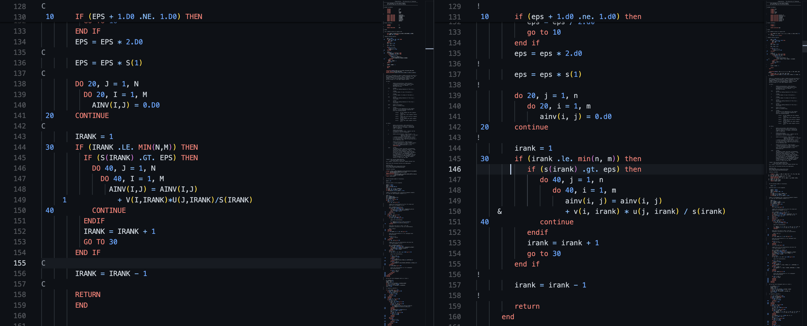

# Fortify
Fortran Formatting Tool

## Overview
Fortify is a Fortran formatting tool designed to help developers maintain consistent and readable code. It provides various features to handle spacing, indentation, and other formatting aspects of Fortran code.


## Features
### Structure Indentation
Will properly indent and nest if, do, subroutine, program, and any other keyword statements that can be ended with an `end`. This works for both free format and fixed format files.

In the case of the do-continue F77 statement, it will find the matching goto-continue and unindent on that. This will work even in a do-loop that contains multiple do's that end on the same continue.



**Note:** All fixed format files will have the first 6 columns reserved, while all free format files use every column

### Line Carry Over
Manages line continuation by finding appropriate places to break lines and carry over to the next line, ensuring code remains within the specified column width.

### Logical/Relational/Math Operator Spacing
Adds spaces around operators such as `<`, `<=`, `>`, `>=`, `/=`, `==`, `//`, `+`, `-`, `*`, `/` as well as their text based counter to ensure proper spacing. This converts, for example, `x.gt.y` to `x .gt. y`.

Special care is taken for `+-` operators for cases such exponentiation (`D` and `E`), as well as cases where a minus (or plus) tends to be connected with the character. For example, the following will be maintained or enforced: `x = -5` instead of `x = - 5`.

### Tab character replacement
Converts the `\t` character to the default tab space of 3. Note that if you change the tab length, and then run it will convert to the updated tab length instead, but once a tab is converted to a set of spaces it will remain that number of spaces if re-run on the same file.

### Comment spacing preservation
Will retain the original spacing between a line comment and a the code. This is done since it is a common practice to have comments lined up in a series after related code.

Lines which are only comments are kept on the first column and kept this way. This can be user defined.

## F77 (.f) Features
#### Continuation Character
In older Fortran, any character may become the continuation character. This formatter enforces the modern `&` in the 6th column. You may change this if you wish.

#### Comment Character
In older Fortran, `*`, `C`, and `c` will change to become `!` by default. You may change this if you wish in the settings.

## Other Features
### Code modernization techinques
By default, it will lower all non-string code. As Fortran is case-insensitive, this does change any code logic, and modernizes the all CAP past of older Fortran code.

### Parenthesis Spacing
Removes spaces formatting for objects around and inside parentheses `( x )` -> `(x)`.

<!-- // "fortify.noFormat": {
                //     "type": "string",
                //     "default": "do not format",
                //     "description": "Warning: this may cause intended side effects if places on an indent identifier (e.g. if, do, endif, enddo lines). Skip formatting line if it sees this string in the comment line. Example: ! do not format. Must be in a comment."
                // } -->

### Remove Extra Space
Removes unnecessary double spacing in a code line to maintain clean and readable code.

### Comma Spacing
Handles spacing around commas to ensure there is a space after each comma, improving readability.

### String Handling
Properly handles strings enclosed in single or double quotes, ensuring they are not broken or improperly formatted.


## User defined inputs
Many defaults are set to the modern Fortran standard, but are able to be re-defined by the user. These include:
| Variable                          | Default Value | Description | 
|-----------------------------------|---------------|---------------|
| Comment Character (F77 only)           | `!`           | Change the first-column comment character |
| Comment Lines | `as_is` | Determine behavior for how comment-only lines are positioned |
| Continuation Character (F77 only)      | `&`           | Can change the 6th column continuation character |
| Tab Length                             | 3             | Set the default tab length |
| Last column length                     | Free Format: `10000`, Fixed Format: `72` | Sets the last usable column, as determined by the current standard. 
| Lowercase all non-string code          | `T`          | Lowercase all code


## Usage
To use Fortify, simply run the tool on your Fortran source files. The tool will automatically apply the formatting rules and update the files accordingly.

## Installation
To install Fortify, clone the repository and run the setup script:

```sh
git clone https://github.com/louoberto/fortify.git
cd fortify
export PATH=$PATH:$(pwd)/source
```
<!-- 
## Contributing
Contributions are welcome! Please fork the repository and submit a pull request with your changes. -->

## License
This project is licensed under the MIT License. See the LICENSE file for details.

## Contact
For any questions or issues, please ask a question on the Q&A or open an issue on the GitHub repository.
